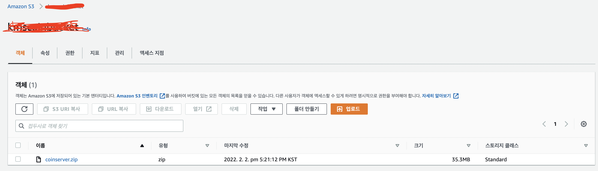
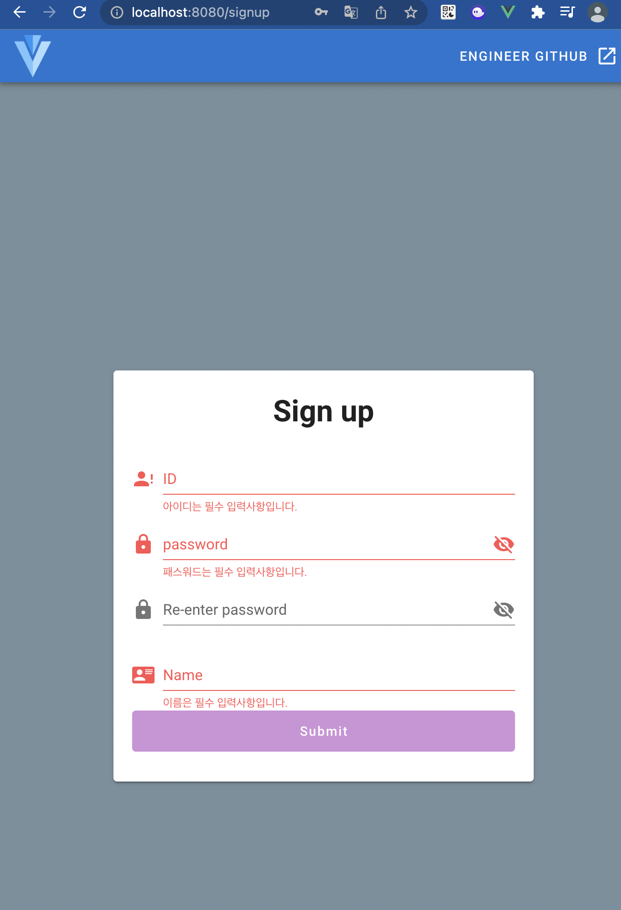

# 2월 1일 AWS로 옮기기

AWS EC2에 서버를 두기로 했다. 이유는 맥으로 작업하다보니 와이파이에 따라 동적으로 ip가 바뀌어서 매 번 설정해주기 귀찮아서.

물론 수작업으로 고정 ip로 바꿀 방법이 분명 있겠지만, 공부할겸 하기로 했다.


여기서도 삽질을 했다.

AWS EC2연동은 오랜만이라 설정 부분에서 일이 있었다.

2가지 삽질이 있었다.

첫 번째는 블로그의 오타를 그대로 따라했다.

설정 부분에서

```text
Host kms
    HostName 어쩌구 저쩌구
    User 어쩌구 저쩌구
    IdentityFile 어쩌구 저쩌구
```

이렇게 써야하는데, IdentityFile 처음에 **IdentifyFile**로 썼다. 내가 본 블로그에서 그대로 복사했더니 오류가 발생.. 그래서 이러한 삽질이 있었다.

두 번째 삽질은 User를 아무렇게나 설정해도 된다는 말에 아무렇게 설정해서 에러가 났다.
AWS EC2에서 지정한 User를 써야 식별이 가능하다. 나같은 경우 us-ec2인가 이렇게 되어 있어서 이렇게 수정해주었다.


그 다음은 bucket을 만들고 IAM을 등록.


EC2환경에서 자바설치.

# 2월 1일 Jenkins 사용

실패. AWS의 EC2, t2.micro는 메모리가 1GB라서 Jenkins 빌드 중에 터지는 에러가 발생.

swap memory를 통해 해결할 수 있다지만, 그냥 gitactions을 사용하기로 정함. 이것도 터지면 swap을 사용해야할 듯

# 2월 3일 Jenkins 폐기 git actions 사용

git action을 사용하는데, 일단 working-directory설정에 삽질을 함. 경로에 오타가 있어서..

local에 배포하는건 성공. 이제 이것을 AWS 서버에 옮기는 작업을 해야한다.

성공.

  

이제 EC2에 배포를 해야한다.

ㅠㅠ 삽질을 ㅈ빠지게 했다.


수많은 배포실패의 흔적..

내가 겪은 에러는 다음과 같은데..

>The deployment failed because no instances were found for your deployment group. Check your deployment group settings to make sure the tags for your Amazon EC2 instances or Auto Scaling groups correctly identify the instances you want to deploy to, and then try again.


글이 길어지므로 이 해결과정은 내 개인블로그에 적었다.

<https://kkminseok.github.io/posts/awsdeploy/>

참고 문헌

<https://stalker5217.netlify.app/devops/github-action-aws-ci-cd-3/>


boot서버를 띄우는것 까지는 성공하였다.

추가로 EIP설정을 해주었다. 인스턴스에 고정ip를 할당한 것이다.


이제 해야하는것들은 다음과 같다고 생각했다.

1. python크롤링 서버도 옮겨야함.
2. 옮긴 서버들이 변화를 감지하고 자동으로 재실행되어야함.


# 2월 3일 python 서버 자동화 배포 과정


자동화 배포를 하는과정에서 에러가 생겼다.

바로 한 번에 배포를 하지 않는다는 것이다.

즉 , 위에서 JAVA를 배포하고 python코드를 배포하려니까 한 번에 처리하지 못하고 따로따로 처리해버린다.

만약 JAVA배포가 먼저 성공하고 python이 다음에 성공하면 기존에 먼저온 JAVA코드는 지워지고 python코드가 덮어씌여진다. 이를 해결해야한다.

git action의 문제라기 보다는 AWS 에서 codedeploy하는과정에서 나타나는 문제라고 생각하고 이에 따른 환경설정을 해주기로 했다.


해결과정이 너무 오래걸려서 하나의 gitaction으로 통일했다.

이 와중에도 많은 버그가 있었으나 .. 일단 한 번에 배포하는건 성공했다.

이를 해결하기 위해서는 **appspec.yml** 파일을 경로별로 수정이 필요하다.

일단 배포가 되면 서버가 자동으로 켜지게끔 바꾸겠다.

<https://velog.io/@tigger/%EB%B0%B0%ED%8F%AC-%EC%9E%90%EB%8F%99%ED%99%94-%EA%B5%AC%EC%84%B1>
참고


일단 -plain.jar 파일 때문에 자동 실행이 안되므로, build.gradle을 건드려서 해당 파일을 생성하지 않게 수정했다.

수정하니 이제 push 때리면 반영된게 자동으로 서버에 적용되어 켜진다.


# 2월 8일 git에 KEY 보존하기

무슨 말이냐면, api KEY를 따로 보관해야한다.

키가 저장된 파일을 올릴 수도 없고 workflow에서 인식해야해서 배포할때 새로운 파일을 만들고,
그 파일에 key를 저장해서 python에서 임포트 하는 코드를 짜도록 했다.

shell scripts를짜서 해결했다. EC2서버에도 잘 가고, 코드도 잘 돌려진다.

참고 : <https://stackoverflow.com/questions/59481933/how-can-i-extract-secrets-using-github-actions>


# 2월 9일 서비스 구체화, ui 구성

로그인을 만들 것이다. 마침 읽고 있는책이 Jwt로 로그인 구현하는 방법에 관한 책이므로 해당 책에 나와있는 내용을 적용할 것이다.

ui를 좀 더 이쁘게 구성해서 바꿔야겠다.

아는 동생이 이런거는 기간을 딱 정해놓는게 좋다해서 로그인 구현은 이번주 내로 마무리할 것이다.

Session방식과 jwt방식 중에 jwt방식을 선택. 이유는 공부도 더 할게 많아지고 서버에 부담을 줄이기 위함이다.


# ~2월14일 vue.js공부, react,aws,springboot책 읽기.

책은 aws에 관해서 학습하기 위해 읽고 있다. 레포지토리를 새로 팠다.

vuejs는 이 프로젝트에 사용하기 위해 공부중이다.

<https://simplevue.gitbook.io/intro/09.-todo>

여기서 학습중인데, vue-router를 학습하다가 에러가 떴다.

vue버전에 맞게 router를 설치해야하는데 그 부분에 대해서 에러가 났다.

해결방법은 router버전을 3.5.3버전으로 설치해주니 되었다.

```bash
npm install vue-router@3.5.3
```
이러면 vue2에서도 잘 동작한다.

2월14일부로 예제를 마무리하긴 했다.

이제 직접 적용해야한다.

그 전에 로그인을 구현하기 위해 책을 읽어야한다.


# 2.15 번외

<https://greeksharifa.github.io/references/2020/10/30/python-selenium-usage/>

이 블로그를 통하여 크롤링에 대해 학습하고 데이터를 가져올 수 있었다.

또한 로그인 창을 구현하기 위해 내가 직접 디자인하면 오래 걸리므로 vuetify를 사용하기로 했다.

```bash
vue add vuefity
```

를 서서 설치하였는데.. 기존 코드가 다 날라갔다.


다시 짜야한다...

# 2.16 로그인 구현

로그인을 구현하려고 했다.

로그인을 구현하기 전에 연결했던 port를 다시 분리할까 했다.

vue.js와 boot모두 같은 포트로 연결해뒀는데, 테스트하기가 번거로웠다.

같은 포트로 요청을 보내야하는데 boot로 키면 boot서버와 vue서버 둘 다 떠버려서 npm run build를 매 번 해줘야하는 귀찮음이 있었다.

vue서버만 켜놓고 boot만 띄우는 방법도 있는것 같은데.. 충돌날까봐 선호 하지는 않았다.

일단 같은 포트에 묶어서 쓰기로 했다.

왜냐하면 배포하기가 편하기 때문이다.

지금 자동화는 그냥 jar파일 하나 만드는데 그 속에 vue에 관한 코드도 다 담겨져 있어서 편하다.

만약 분리한다면 CI/CD코드를 다시 작성해야한다.. 그러긴 싫다.

-----

로그인을 구현했다.


이제 요청을 보내고 

보안(토큰)을 적용해서 통신을 잘 이루나 봐야겠다.

# 2.16 JWT토큰을 이용한 로그인 구현


구현했다.

참고 사이트는 여기다

<https://goodteacher.tistory.com/99?category=857269>


다만 정말 Jwt만 구현한거기에, redis에 user정보를 넣고 검증해야하는 과정을 추가해야한다.

+ refreshtoken이 없어서 추가해야한다.

redis에 집어넣기 전에 user를 db에서 어떻게 관리할지 고민했다.

그냥 userid를 키를 갖게해서 redis에 집어넣었다.

# 2.18 회원가입 구현

로그인을 구현하고 테스트하다보니, 회원가입을 만들어야겠다는 생각이 들었다.

내가 직접 폼을 조작하고 싶은데 그게 마음처럼 잘 되었으면 좋겠다.

  

비슷한 느낌으로 폼을 만들었다.

이걸 만드면서 vue.js에서 제공하는 컴포넌트 개념을 잡는데 도움이 되었다.

똑같은 코드를 친게 아닌 템플릿만 가져다가 수정할 곳만 수정했다.

지금은 유효성 검사를 하는데, vue.js에서 제공하는 *this* 때문에 코드가 꼬이고 있다.

> 해결했다. <https://hj-tilblog.tistory.com/78> Es5와 Es6의 문법차이로 발생한 에러

부모의 프로퍼티를 가져온다는데.. 아무튼 이걸 고치면 boot서버에 정보를 보내고 DB에 저장하고 
다음 view를 보내면 될 것이다.


# 2.21 회원가입 통신 성공

통신하기가 생각보다 빡셌다.

그냥 내 지식이 모자란 탓이겠지만, controller에서 responsebody로 그냥 응답을 보냈으면 되었는데, 그 하나를 몰라서 몇 시간 삽질을 했다..

통신까지는 완료했고, 

하나 해야할 것이 password를 암호화해서 담는 것이다.

지금은 콘솔로 password가 잘 도착했는지 직접 찍어내고 있다.

  

암호화 처리를 하고 db에 넣도록 하겠다.

암호화해서 DB에 저장했다.


이제 로그인 로직 구현, JWT를 계정마다 적용할 차례다.

**중복처리해야한다.**
**아이디 비밀번호 찾기**


