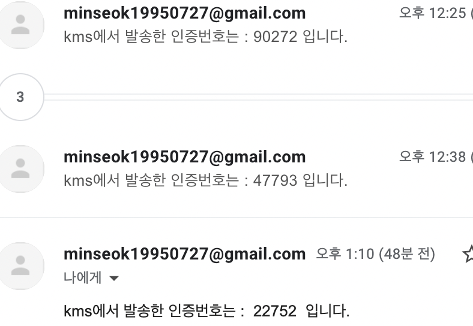

# 3월 2일

아이디찾기, 비밀번호 찾기를 위해서 이메일 전송 시스템을 만들어야했다.

이메일 인증을 채택한 이유는 본인인증을 하기 위한 제일 간편한 방법이라고 생각했다.

## 3.2.1 이메일 검증 코드

먼저 이메일이 존재하는지 확인해야했다.

이메일 양식은 인터넷을 찾다보면 빠르게 나오는 편이지만 이메일 검증은 좀 더 학습이 필요했다.

이메일 검증에 성공했지만 점점 프론트의 변수값들이 많아지면서 리팩토링할 필요성을 느꼈다.

  

## 3.2.2 데이터 리팩토링

데이터값들을 리팩토링 할 것이다.

rules, user정보, alert, error등은 각각 객체로 만들어서 관리할 것이다.

리팩토링도 했다.

## 3월 3일

먼저 도착하자마자 이메일검증까지 완료된 코드를 배포했다.

aws에서 smtp기본포트인 25를 허용하지 않아서(해결하는 방법은 있다.) 587포트로 이메일검증 시스템을 만들었다.

이제 메인 화면 레이아웃을 구성해야한다.

## 3월 7일

메인 화면을 구성해야 하는데, vue.js 컴포넌트들이 꼬이는 이슈가 발생해서 해결중..

## 3월 13일

해결은 완료했다. 보아하니까 view가 사라진게 아니고 v-app으로 감싸져서 한 페이지크기로 연달아 두개가 들어감. 그래서 밑으로 스크롤해야 보이는 상황이 발생해버림.

앞으로는 기존에 있던 컴포넌트를 리팩토링 해야하고, 연결 시키자. 그리고 메인을 꾸미자.

## 3월 20일

  

이러한 프로젝트 구조를 바꿀것이다.

- components는 화면에 보여지는 것들
- compostions는 초기값 셋팅들
- api는 통신관련 셋팅값들
- pages는 각 컴포넌트를 잇는 가장 최상단 루트
- router는 router에 필요한 값들.

그럴려고 했으나.. vue 2버전과 vue3버전의 문법 방식, 구조방식이 달라 혼동을 겪어버렸다.

포기.

다음 프로젝트때는 vite를 이용한 vue3 버전을 사용해야겠다.. 지금 읽고 있는 책이 vite + vue3버전이다.

git email이 정상적으로 등록되지 않아서 잔디가 안 심어졌다. 이것을 확인하기 위한 commit용

생각해보니 Login이 메인으로 보여지면 안 되는것이고, main화면을 따로 구성해야할 것 같다.

다시 만들어야할듯..?
