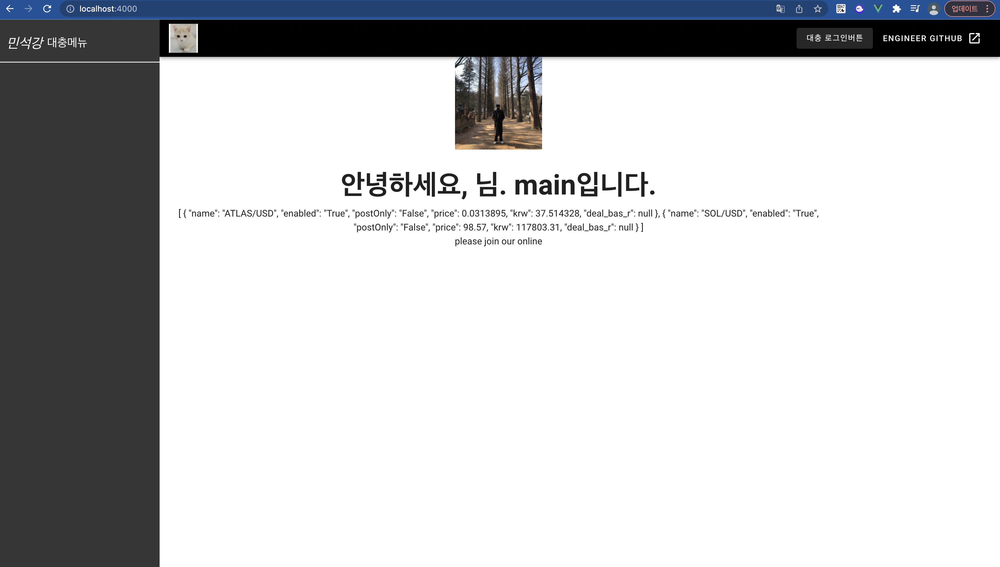

# 4월 9일

그간 책을 읽는다고 하지 못했다.

먼저 해야할것을 목표로 잡았는데,

- main의 위치를 바꾸자.
  - 로그인을 통해 main으로 가는건 접근성이 굉장히 떨어지는 것을 알아싿.
- cors문제가 발생
  - 왜 인지 모름 고쳐야함.
- main의 위치를 바꾸면 당연하게도 헤더에 로그인, 로그아웃 등 버튼이 생겨야함.
- 로그 추가.
  - 진입시 누가 들어왔는지, 언제 들어왔는지에 대한 정보가 필요해졌음. 서버쪽에도 로그가 필요.
## main의 위치를 바꾸자.

은 이미 저번에 해결한듯. 메인으로 가진다.

## main의 위치를 바꾸면 로그인, 로그아웃 버튼 추가

이는 레이아웃을 다시 구상중이다.

왼쪽에는 메뉴를 놓고 타이틀바도 놓고 싶은데

화면이 작아졌을때는 메뉴바를 안 보이게 하는게 맞는지 생각중.




vuex를 적용하기로 했다.

menu들의 상태관리를 해줘야하기 때문이다.

vuex의 최신버전(vuex4)는 vue2버전에서는 적용되지 않으므로 

```bash
npm install vuex@3.6.2
```

로 vuex3버전의 마지막 버전을 설치했다.