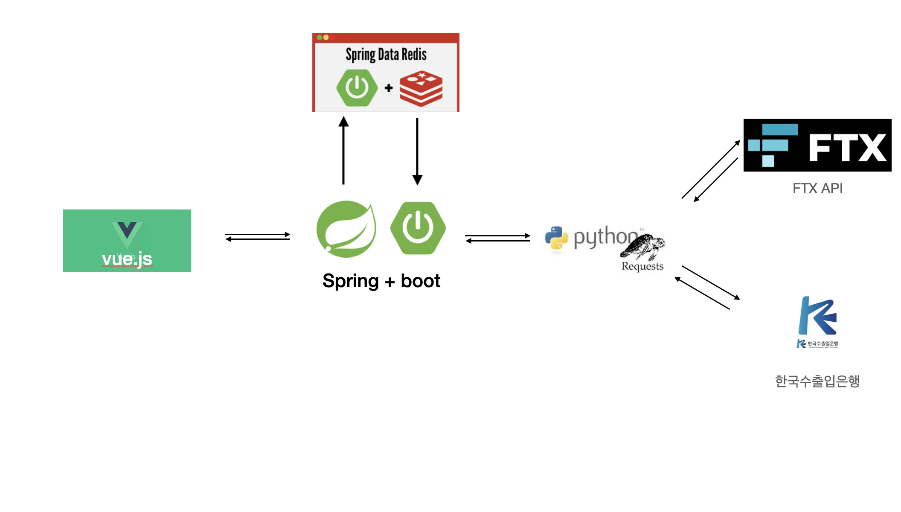
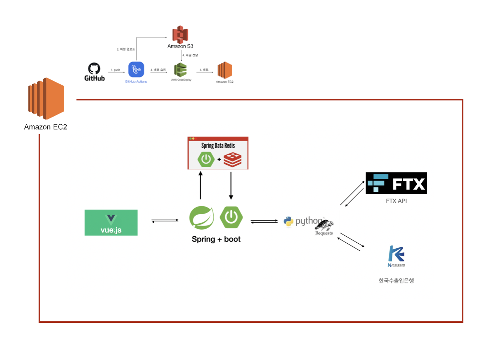

# 소개 

아틀라스 게임을 해봤는데, 단위가 0.00002이렇게 쪼개져있어서 한국돈으로 치환하기 불편함.

해당 코인시세보기 -> 환율보기 -> 게산기 켜서 계산 하는 과정을 거쳐야하는데, 자동으로 처리할 수 있게끔 하고 싶음.

또한, 나만의 포트폴리오를 만들어 보고싶음.

------

0203

  

그림은 계속 추가될 것.

# 사용한 기술, 환경

환경 : mac + AWS EC2(free tier)

언어 : js, python, java

핵심 라이브러리, 프레임워크 : vue.js, Spring + boot, Requests, beautifulsoup, Selenium

DB : Redis

API : FTXAPI(코인 시세정보), 한국수출입은행(환율정보)

CI/CD 구축

