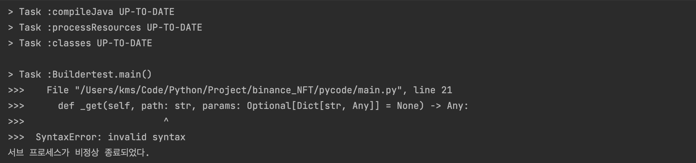
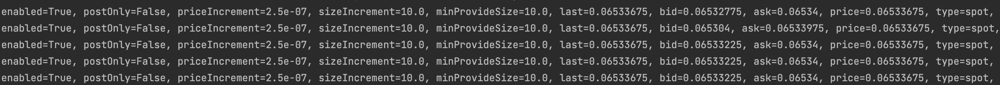
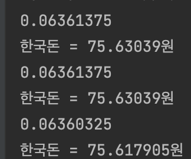
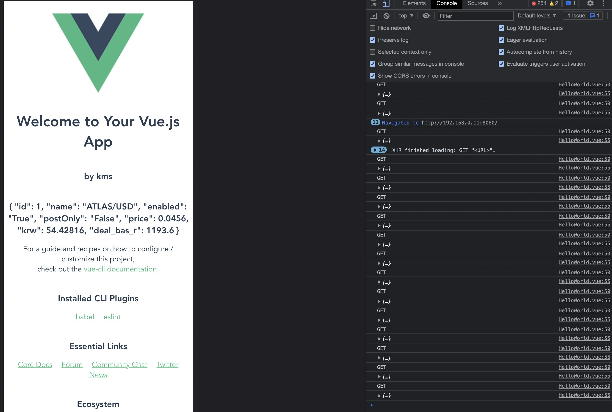

# binance_NFT

진행상황(01.18) : Binance에 상장되어있지 않아서 FTX거래소 API를 사용.

<https://docs.ftx.com/?python#rest-api>

Python 예제 코드를 참조하여 코드를 작성. 

시크릿키가 포함되어 있기에 소스코드는 안 올림.

GET요청 성공.

FTX API에 공부해야함..

----- 

## 삽질의 기록

FTX 거래소에서 Python을 지원해서 일단 데이터를 긁어오는데에는 성공했다.

하지만, 나는 자바를 주로 이용해서 고민이 생겼다.

Python 데이터를 Java단으로 옮기고 싶었다.

물론 Django를 이용해서 하나의 서버에서 처리할 수도 있지만, 따로 배우고 싶지않았다.

여기서 발목이 잡히고 싶지 않아서 Python 데이터를 java단으로 옮겨주기로 했다.

생각한 것은 3개다.

1. rgpc 
2. RestAPI
3. 셸스크립트

### 셸스크립트

먼저 셸 스크립트 방식을 사용했다.  
<https://velog.io/@latte_h/Java%EC%97%90%EC%84%9C-Python-%EC%82%AC%EC%9A%A9%ED%95%98%EA%B8%B0>

이 블로그를 참조하였는데, 결국에는 실패했다.

내 생각에는 저 방식은 정말 위에서부터 코드를 한줄한줄 처리하는것 같은데 비효율적이라고 생각이 들었고, 무엇보다도 그렇게 실행되면 안되었다.

### rgpc

좀 찾아봤는데, 문법도 그렇고 공부하기 어려워서 일단 RestAPI를 써보기로 했다. 구현해야할 부분이 많기때문에..

### RestAPI

python의 Requests객체를 생성하여 처리한다.

통신을 잘한다.

해당 데이터를 가지고 내가 알고있는 코인과 환율을 연동해서 한국돈으로 바꿔서 출력하는데까지 성공했다.

떡락의 길을 걷고있네.

### Node js + Vue.js 설치

클라이언트쪽에서 위에서 긁어온 데이터를 받아주고 요청할 서버가 없다는 것을 알았다.

처음에는 ajax를 사용할까 했지만, 뷰도 한꺼번에 그려주고 싶기도 하고 vue.js를 배워보고 싶어서 골랐다.

react와 vue중에 뭐를 사용할까 고민을 많이했는데, vue.js문법이 상대적으로 쉽다는 말에 vue.js를 골랐다. 중요한건 로직이지 화면에 그리는게 문제가 아니기 때문이었다.

아무튼 설치하는 과정은

<https://imasoftwareengineer.tistory.com/39>

이 블로그를 참고했다.

과정에 삽질이 많았지만 아무튼 띄우기까지 완료

vue에 대한 기초적인 지식을 학습하기 위해 인프런에서 강의를 들은 후 모르는건 찾아서 해야겠다.

주말동안 vue에 대한 공부를 하고 데이터를 옮기는데에 성공했다.

GET요청으로 Spring서버에 요청을 보내 코인에 대한 정보를 받아오고 이를 동적으로 뿌려준다.

즉, 저 화면이 요청을 보낼때마다 바뀐다. 요청은 하루 api호출 제한으로 30초마다로 잡았다.

- 이제 서비스 기능을 더 추가할 것이다.
- 디비는 인메모리로 그냥 HashMap에 저장해서 사용하고 있는데, Redis를 사용해보고 싶다.
- 화면 꾸미는건 나중에

서비스 부분을 추가하는것에 집중해야겠다.

-----

